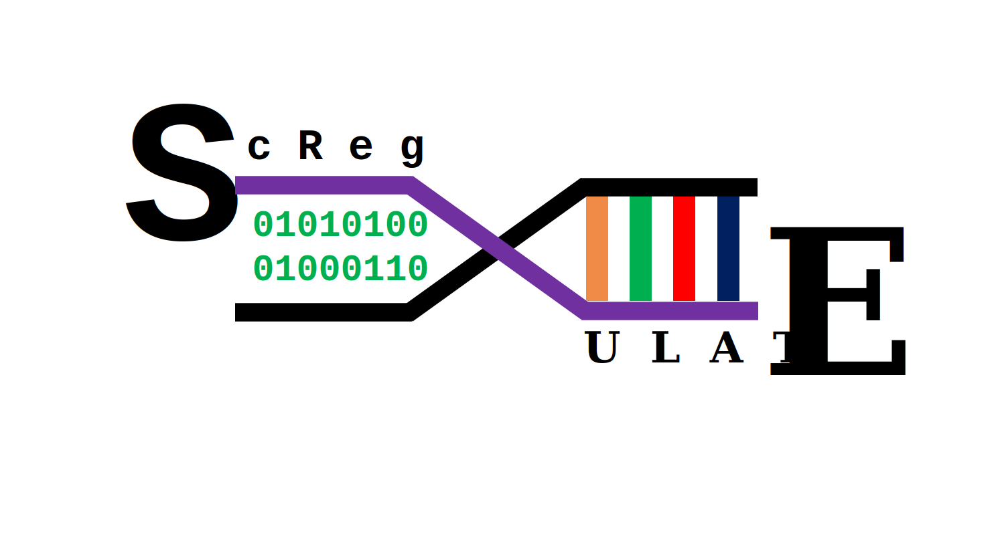

# REGULOMICS
**R**egulatory **E**mbedded **G**enerative **U**nified **L**earning for **O**ptimized **M**odeling and **I**nference of Transcription Factor Activity and **C**lustering in **S**cRNA-seq Omics

[](https://github.com/zandigohar/REGULOMICS/issues)


## Introduction
**REGULOMICS** is a powerful tool designed for the inference of transcription factor activity from single cell/nucleus RNA data using advanced generative modeling techniques. It leverages a unified learning framework to optimize the modeling of cellular regulatory networks, providing researchers with accurate insights into transcriptional regulation. With its efficient clustering capabilities, **REGULOMICS** facilitates the analysis of complex biological data, making it an essential resource for studies in genomics and molecular biology.

For further information and example tutorials, please check our [documentation](https://readthedocs.org/projects/REGULOMICS/badge/?version=latest).

If you have any questions or concerns feel free to [open an issue](https://github.com/zandigohar/REGULOMICS/issues).

## Requirements
REGULOMICS is implemented in the PyTorch framework. Running REGULOMICS on CUDA is highly recommended if available.

Before installing and running REGULOMICS, ensure you have the following libraries installed:

- **PyTorch** (version 2.0 or higher)
- **NumPy** (version 1.23 or higher)
- **Scanpy** (version 1.9 or higher)
- **Anndata** (version 0.8 or higher)

You can install these dependencies using `pip`:

```bash
pip install torch numpy scanpy anndata
```

## Installation

You can install **REGULOMICS** via pip for a lightweight installation:

```bash
pip install REGULOMICS
```

Alternatively, if you want the latest, unreleased version, you can install it directly from the source on GitHub:

```bash
pip install git+https://github.com/zandigohar/REGULOMICS.git
```

For users who prefer Conda or Mamba for environment management, you can install **REGULOMICS** along with extra dependencies using:

```bash
mamba create -n=REGULOMICS conda-forge::REGULOMICS
```

## License

The code in **REGULOMICS** is licensed under the [MIT License](https://opensource.org/licenses/MIT), which permits academic and commercial use, modification, and distribution. 

Please note that any third-party dependencies bundled with **REGULOMICS** may have their own respective licenses.

## Citation

If you use **REGULOMICS** in your research, please cite:

Mehrdad Zandigohar, Jalees Rehman and Yang Dai. 2025. **REGULOMICS: Regulatory Embedded Generative Unified Learning for Optimized Modeling and Inference of Cellular Transcription Factor Activity.** Journal/Conference Name. [DOI link here]

